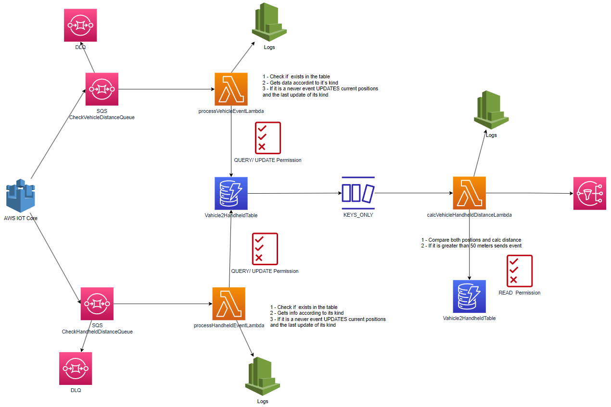

# AWS IoT Check Distance Serverless Application

This application is designed to read current positions (latitude, longitude) from IoT devices received via AWS IoT Core. The data is processed using SQS queues, Lambda functions, and DynamoDB streams.

 <!-- Add a picture of the architecture here. Place the image file named "architecture.png" in the same directory as this README.md file. -->

## Steps to Run

1. Useful commands:

    ```bash
        npm install
        npm package
    ```
  
2. Deployment to AWS
    ```bash
     cdk deploy --profile <your_aws_profile>
    ```
    
3. Testing
    ```bash
     npm run test
    ```